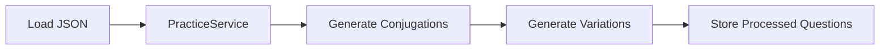
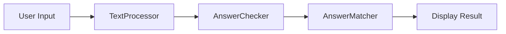
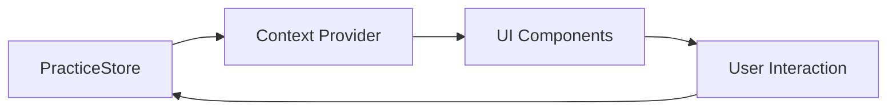

# Japanese Sentence Practice - Technical Documentation

## Project Structure

```
src/features/sentence-practice/
├── core/
│   ├── answer-processing/
│   │   ├── AnswerChecker.ts      # Handles answer validation and matching
│   │   ├── AnswerMatcher.ts      # Compares user input with correct answers
│   │   ├── VariationGenerator.ts # Generates answer variations
│   │   └── types.ts              # Answer-related type definitions
│   ├── conjugation/
│   │   ├── ConjugationEngine.ts  # Main conjugation processing
│   │   ├── ConjugationRules.ts   # Rules for conjugation patterns
│   │   └── types.ts              # Conjugation-related types
│   ├── grammar/
│   │   ├── HonorificHandler.ts   # Handles honorific variations
│   │   ├── PronounHandler.ts     # Manages pronoun variations
│   │   └── types.ts              # Grammar-related types
│   ├── text/
│   │   ├── TextProcessor.ts      # Text normalization and processing
│   │   └── KanjiProcessor.ts     # Kanji/reading handling
│   └── PracticeService.ts        # Main orchestration service
├── store/
│   ├── PracticeContext.tsx       # Store context provider
│   ├── practiceStore.ts          # State management
│   └── types.ts                  # Store state types
└── ui/
    └── practice/
        ├── PracticeContainer.tsx # Main practice component
        ├── PromptDisplay.tsx     # Question display
        ├── AnswerInput.tsx       # User input handling
        ├── ProgressDisplay.tsx   # Progress tracking
        └── ResultDisplay.tsx     # Answer feedback display
```

## Core Features

### Answer Processing

- **Answer Checking**: Validates user input against all possible correct answers
- **String Matching**: Uses dynamic programming for fuzzy matching
- **Error Highlighting**: Identifies and displays differences between input and correct answers

### Conjugation System

- **Rule-Based Conjugation**: Handles verb and adjective conjugations
- **Form Management**: Supports polite/casual and past/non-past forms
- **Context Awareness**: Adjusts conjugation based on following words

### Variation Generation

- **Answer Variations**: Generates all valid forms of answers
- **Politeness Forms**: Handles です/ます and plain forms
- **Pronoun Variations**: Manages first-person pronoun alternatives
- **Honorific Handling**: Processes さん/くん/ちゃん variations

### Text Processing

- **Kanji Processing**: Maintains kanji with readings through conjugation
- **Text Normalization**: Standardizes input for comparison
- **Furigana Handling**: Processes reading brackets [読]み

## Data Flow

1. **Initialization**



2. **Answer Processing**



3. **State Management**



## Usage Example

```typescript
// Initialize practice
const practiceService = new PracticeService()
const questions = await loadQuestions("path/to/questions.json")
const processedQuestions = practiceService.prepareQuestions(questions)

// Check answer
const result = practiceService.checkAnswer(userInput, currentQuestion)

// Access via store
const { store, actions } = usePracticeStore()
actions.checkAnswer()
actions.nextQuestion()
```

## Key Technical Features

### Type Safety

- Comprehensive type definitions for all components
- Type guards for conjugation patterns
- Strict typing for store state

### Performance

- Efficient variation generation
- Memoized text processing
- Optimized string matching

### Extensibility

- Modular architecture
- Clear separation of concerns
- Easy addition of new variation types

### Maintainability

- Clear component responsibilities
- Consistent error handling
- Well-documented interfaces

## Configuration Options

```typescript
interface PracticeState {
  questions: PracticeQuestion[]
  currentQuestionIndex: number
  currentInput: string
  showResult: boolean
  isLoading: boolean
  error: string | null
  path: string | null
  showFurigana: boolean
}
```

This system provides a robust foundation for Japanese language practice, with clear separation of concerns and extensible architecture.
